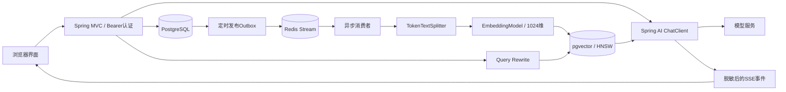

# 架构与项目经历对照

## 要求对照

| 简历中的要求 | 当前实现 | 验证边界 |
|---|---|---|
| 10+ 方向 Skill 驱动出题 | Skills 中12个方向，范围映射到系统提示，逐轮追问 | 单个方向的题目质量需人工评测 |
| 简历 AI 分析 | PDFBox/Tika正文提取，扫描页面本地Tesseract中英文OCR、异步分析、与面试关联 | PDF最多10页、单页OCR超时45秒；模糊内容可能识别错误 |
| SSE 流式对话 | Spring AI响应流 → 句子缓冲脱敏 → SseEmitter | 非逐 token 直通，保护跨token敏感内容 |
| TokenTextSplitter + 1024维 | 按token分块，检查Embedding维度与有限值 | 需服务商支持dimensions |
| pgvector / HNSW / 多库隔离 | 显式向量表、HNSW索引、所有查询绑定owner与kb | 检索计划需真实数据验证 |
| Query Rewrite | 使用最近多轮上下文改写独立检索问题 | 改写可能引入误差，需召回数据集 |
| 动态Top-K与阈值 | 短查询K=8/阈值0.55，其余K=5/阈值0.35 | 默认起点，不能声称最优 |
| Redis Stream异步任务 | DB outbox、消费组、ACK、失败重试3次、终态幂等跳过 | 单消费者恢复；不支持完整多副本故障转移 |
| 输入/数据/输出三层防护 | Guard模式校验、Bearer身份及参数化scope查询、句子级脱敏 | 不是对任意Prompt Injection的防御保证 |
| SafeGuardAdvisor / OutputGuardAdvisor | 官方SafeGuardAdvisor拦截关键词，自定义CallAdvisor在实体转换前脱敏 | SSE另用句子缓冲脱敏，防止跨token泄露 |
| 15s → 200ms、拦截率99%等 | 尚未实测 | 不作为完成的性能结果 |

## 可靠性设计

任务先持久化 job，再由定时发布器发送 Redis Stream。发布成功而 DB 标记失败时可重复投递；终态跳过、向量写入的整批事务与 job_id/ordinal 唯一约束让重试不会产生重复分块。调用模型失败不 ACK，保留 pending；同名消费者重启后优先读取自己的 pending。超过三次后 FAILED 并 ACK。

上传请求只做基本校验、持久化文件字节和创建任务。文档解析、扫描页OCR、模型与向量化在消费者执行；页面显示当前阶段并自动刷新。解析结果成功后清理原文件字节，解析失败直接进入FAILED并显示操作建议；模型临时失败最多重试3次。上传仍需等待文件传输和数据库写入，不能保证任意大文件响应200ms。队列积压、重试退避和跨消费者claim仍是扩展方向。

聊天生成用 Redis 会话锁避免同一会话交错；complete 后一次事务写入用户回答、助手回答与轮数。网络取消释放租约并取消订阅。锁释放采用 compare-and-delete，避免误删新租约。

## 可复现性能测量建议

1. 为每类任务准备固定的输入数据、模型、并发数和硬件说明。
2. 分开统计上传/入队延迟、排队时间、处理总时间、SSE首句时间和完整响应时间。
3. 对查询改写、短查询阈值和HNSW设置建立对照组，记录Recall@K、无答案比例和误引用率。
4. 用至少两名用户和两个知识库验证越权，包括文档、任务、面试历史和检索来源。
5. 断开Redis、重启消费者、制造模型错误，核对恢复、重试与终态；当前不应按多实例运行。

没有这些测量结果前，项目可以描述为“实现了”，不应描述为“已达到某性能指标”。
